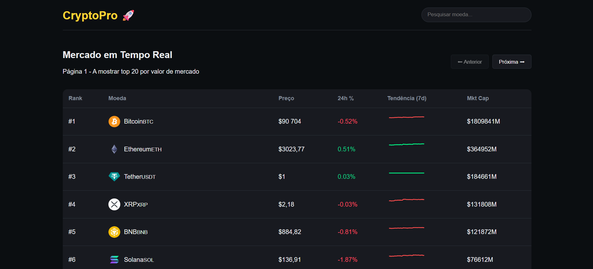

# 🚀 CryptoPro - Dashboard de Criptomoedas em Tempo Real


> Um dashboard financeiro interativo que consome dados reais do mercado de criptomoedas, focado em visualização de dados e performance.

## 📸 Preview



## 💡 Sobre o Projeto

Este projeto foi desenvolvido para simular uma interface profissional de exchange (como Binance ou CoinMarketCap). O objetivo principal foi consolidar conhecimentos em **Consumo de APIs**, **Gerenciamento de Estado Complexo** e **Visualização de Dados**.

Diferente de listas simples, este dashboard implementa paginação real via API e renderização condicional de modais para detalhamento de dados (Drill-down).

## ✨ Funcionalidades

- **📡 Dados em Tempo Real:** Consumo da API pública da CoinGecko.
- **📊 Visualização de Dados:** Gráficos de área (Sparklines) mostrando a tendência dos últimos 7 dias usando `Recharts`.
- **🔎 Filtro Inteligente:** Pesquisa instantânea por nome ou símbolo da moeda.
- **📄 Paginação Server-Side:** Navegação entre páginas carregando novos dados da API sob demanda.
- **📱 Modal Interativo:** Clique em qualquer linha para abrir um card flutuante com detalhes avançados (Máxima/Mínima 24h, Volume, Gráfico expandido).
- **🎨 Dark Mode UI:** Interface moderna e responsiva focada na legibilidade.

## 🛠️ Tecnologias Utilizadas

- **React.js (Vite):** Para construção da interface e performance.
- **Axios:** Para requisições HTTP assíncronas e tratamento de erros.
- **Recharts:** Biblioteca para composição dos gráficos financeiros.
- **CSS Modules/Standard:** Estilização responsiva e customizada (sem frameworks CSS pesados).

## 🚀 Como Rodar o Projeto

1. **Clone o repositório**
   ```bash
   git clone [https://github.com/SEU-USUARIO/crypto-dashboard.git](https://github.com/SEU-USUARIO/crypto-dashboard.git)
